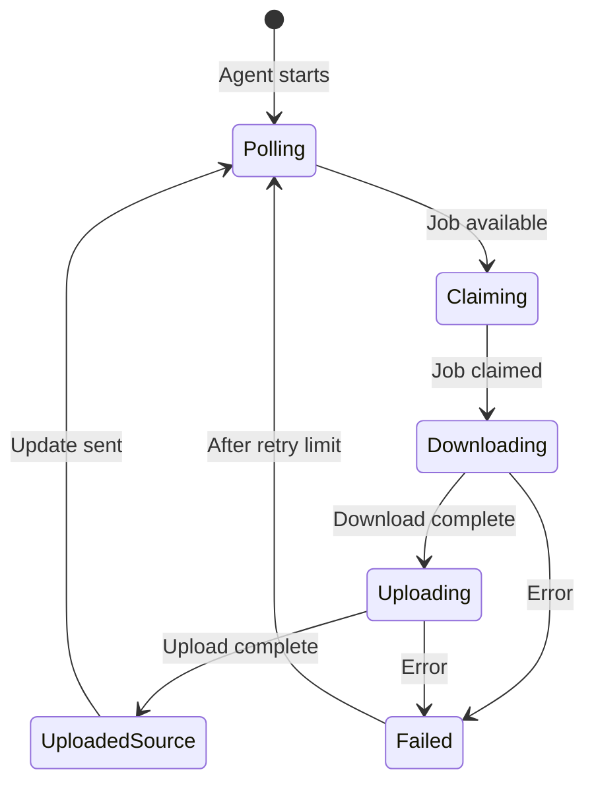
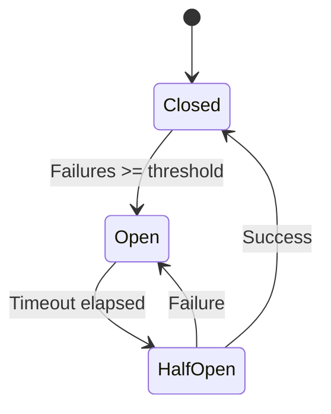

# Karaoke Agent

Distributed node for the karaoke processing network. Run on any home PC to contribute to stem separation.

**Version:** 4.0 (Local Demucs + AWS S3)
**Last Updated:** 2026-01-07

## Overview

Karaoke Agent lets anyone join the processing network:
1. **Download** YouTube videos (residential IP bypasses rate limiting)
2. **Process locally** if you have an NVIDIA GPU (FREE!)
3. **Or send to Runpod** if you don't have a GPU (~$0.02/song)
4. Upload to AWS S3 and trigger publish

**Requirements:** Python 3.11+, yt-dlp, Docker (for GPU processing)
**Optional:** Any NVIDIA GPU (GTX 1060 or better) for local Demucs
**Storage:** AWS S3 bucket `karaoke-pimpshizzle`
**CDN:** CloudFront at `https://karaoke.1215group.com/`

```
┌─────────────────┐    ┌─────────────┐    ┌──────────────┐
│   React UI      │───►│  Supabase   │───►│    n8n       │
│  (song request) │    │  (job queue)│    │  (webhooks)  │
└─────────────────┘    └──────┬──────┘    └──────────────┘
                              │
                              ▼
    ┌─────────────────────────────────────────────────────┐
    │           DISTRIBUTED NODE NETWORK                   │
    │                                                      │
    │  ┌──────────────┐  ┌──────────────┐  ┌────────────┐ │
    │  │  Node A      │  │  Node B      │  │  Node C    │ │
    │  │  (GPU: 4070) │  │  (GPU: 3060) │  │  (No GPU)  │ │
    │  │  LOCAL mode  │  │  LOCAL mode  │  │ RUNPOD mode│ │
    │  │  FREE!       │  │  FREE!       │  │ ~$0.02/song│ │
    │  └──────────────┘  └──────────────┘  └────────────┘ │
    │                                                      │
    │  All nodes: residential IPs bypass YouTube limits    │
    │  GPU nodes: process locally for FREE                 │
    │  CPU nodes: still help by downloading, Runpod splits │
    └─────────────────────────────────────────────────────┘
```

## Features

- **Local GPU Stem Separation**: RTX 4070 runs Demucs htdemucs_6s locally (FREE!)
- **Residential IP Downloads**: Runs on home network to avoid YouTube rate limiting
- **Dashboard Toggle**: Switch between LOCAL (free) and RUNPOD (paid) processing
- **Robust S3 Uploads**: Multipart upload with 524 timeout handling and resumability
- **Health Monitoring**: Heartbeat reporting to Supabase for observability
- **Circuit Breaker**: Prevents cascading failures when services are down
- **Lease Renewal**: Keeps job ownership during long processing
- **Graceful Shutdown**: SIGTERM/SIGINT handling for clean stops
- **Docker Integration**: Demucs runs in container with NVIDIA runtime

## Installation

### Docker (Recommended)

The agent runs containerized with yt-dlp, ffmpeg, PyTorch, and Demucs bundled. The same image works with or without GPU based on environment variables.

**Prerequisites:**
- Docker (Docker Desktop on Windows/Mac, or Docker Engine on Linux)
- NVIDIA GPU + Container Toolkit (optional, for local stem splitting)

#### Quick Start (CPU-only mode)

For machines **without** an NVIDIA GPU. Downloads videos and sends to RunPod for processing (~$0.02/song).

```bash
cd karaoke-agent

# Create .env file with your configuration
cat > .env << 'EOF'
# Worker identity
WORKER_ID=home-agent-mypc

# Processing mode (no GPU = RunPod)
STEM_SPLITTING_ENABLED=false
DEMUCS_DIRECT_MODE=false

# API Configuration
VPS_API_BASE=https://n8n.1215group.com/webhook
WORKER_TOKEN=your-worker-token

# Supabase
SUPABASE_URL=https://your-project.supabase.co
SUPABASE_SERVICE_ROLE_KEY=your-service-key

# S3 Storage
AWS_S3_ENDPOINT=https://s3.amazonaws.com
AWS_S3_BUCKET=karaoke-pimpshizzle
AWS_ACCESS_KEY_ID=your-access-key
AWS_SECRET_ACCESS_KEY=your-secret-key
AWS_REGION=us-east-1
EOF

# Build and run
docker compose up -d

# View logs
docker compose logs -f

# Stop
docker compose down
```

#### GPU Mode (Local Stem Splitting)

For machines **with** an NVIDIA GPU (GTX 1060 or better). Processes stems locally for FREE!

```bash
cd karaoke-agent

# Create .env with GPU enabled
cat > .env << 'EOF'
WORKER_ID=home-agent-gpu-pc
STEM_SPLITTING_ENABLED=true
DEMUCS_DIRECT_MODE=false

# ... (same API/S3 config as above)
EOF

# Run with GPU overlay
docker compose -f docker-compose.yml -f docker-compose.gpu.yml up -d

# View logs
docker compose logs -f
```

#### Manual Docker Build

```bash
# Build image
docker build -t karaoke-agent .

# Run without GPU (CPU-only)
docker run -d --env-file .env --name karaoke-agent karaoke-agent

# Run with GPU
docker run -d --gpus all --env-file .env --name karaoke-agent karaoke-agent
```

### Native Installation (Development)

For development without Docker:

**Prerequisites:**
- Python 3.11+
- [uv](https://github.com/astral-sh/uv) package manager
- [yt-dlp](https://github.com/yt-dlp/yt-dlp)
- ffmpeg
- PyTorch with CUDA (for local Demucs)

```bash
# Clone and navigate to the package
cd karaoke-agent

# Install with uv
uv venv
uv pip install -e .

# Install PyTorch with CUDA (if running Demucs locally)
uv pip install torch torchaudio --index-url https://download.pytorch.org/whl/cu121
uv pip install demucs

# Copy and configure environment
cp systemd/env.example .env
# Edit .env with your configuration

# Set DEMUCS_DIRECT_MODE=true if Demucs is installed natively
# Set DEMUCS_DIRECT_MODE=false to use Docker for Demucs

# Run once to test
uv run karaoke-agent --once --dry-run

# Run continuous loop
uv run karaoke-agent --loop
```

### Systemd Service

```bash
# Install systemd service
cd systemd
sudo ./install.sh

# Enable and start
sudo systemctl enable karaoke-agent
sudo systemctl start karaoke-agent

# View logs
journalctl -u karaoke-agent -f
```

## Configuration

All configuration is via environment variables (or `.env` file):

### Required

| Variable | Description |
|----------|-------------|
| `VPS_API_BASE` | n8n webhook base URL |
| `WORKER_TOKEN` | Authentication token for API |
| `SUPABASE_URL` | Supabase project URL |
| `SUPABASE_SERVICE_KEY` | Service role key |
| `AWS_S3_ENDPOINT` | AWS S3 endpoint (https://s3.amazonaws.com) |
| `AWS_S3_BUCKET` | AWS S3 bucket name (karaoke-pimpshizzle) |
| `AWS_ACCESS_KEY_ID` | AWS access key ID |
| `AWS_SECRET_ACCESS_KEY` | AWS secret access key |
| `AWS_REGION` | AWS region (us-east-1) |

### Optional

| Variable | Default | Description |
|----------|---------|-------------|
| `WORKER_ID` | `home-agent-{pid}` | Unique worker identifier |
| `POLL_INTERVAL_SECONDS` | `30` | Seconds between job claims |
| `HEARTBEAT_INTERVAL_SECONDS` | `60` | Health report interval |
| `DOWNLOAD_DIR` | `/var/lib/karaoke-agent/spool` | Temp download directory |
| `MAX_RETRIES` | `3` | Retries per operation |
| `MAX_JOB_RETRIES` | `3` | Retries per job |

See `systemd/env.example` for complete list.

## CLI Usage

```bash
# Continuous worker mode (default)
karaoke-agent --loop

# Process single job and exit
karaoke-agent --once

# Test without actual downloads/uploads
karaoke-agent --once --dry-run

# Validate configuration
karaoke-agent --config-check

# Debug logging
karaoke-agent --loop --verbose

# Show version
karaoke-agent --version
```

## Architecture

### Module Structure

```
karaoke-agent/
├── src/karaoke_agent/
│   ├── __init__.py         # Package version
│   ├── agent.py            # Main KaraokeAgent class
│   ├── cli.py              # Click CLI interface
│   ├── config.py           # Pydantic configuration
│   ├── s3_multipart.py     # Robust S3 uploader
│   ├── supabase_client.py  # Backend API client
│   ├── yt_dlp_wrapper.py   # YouTube downloader
│   └── utils/
│       ├── __init__.py
│       └── circuit_breaker.py
├── tests/
├── systemd/
└── pyproject.toml
```

### Job Processing Flow



### Circuit Breaker States



## Development

### Setup

```bash
# Install with dev dependencies
uv pip install -e ".[dev]"

# Run tests
pytest

# Run with coverage
pytest --cov=karaoke_agent

# Type checking
mypy src/karaoke_agent

# Linting
ruff check src tests
ruff format src tests
```

### Test Markers

```bash
# Skip integration tests
pytest -m "not integration"

# Skip slow tests
pytest -m "not slow"
```

## Troubleshooting

### Agent won't start

1. Check configuration: `karaoke-agent --config-check`
2. Verify environment variables are set
3. Check download directory permissions

### Downloads failing

1. Check yt-dlp is installed: `yt-dlp --version`
2. Verify network connectivity
3. Check disk space: `df -h`

### S3 uploads failing

1. Verify S3 credentials
2. Check S3 endpoint is reachable
3. Look for circuit breaker status in logs

### Systemd service issues

```bash
# Check service status
systemctl status karaoke-agent

# View full logs
journalctl -u karaoke-agent --no-pager

# Check for permission issues
ls -la /var/lib/karaoke-agent
ls -la /opt/karaoke-agent/.env
```

## License

MIT
