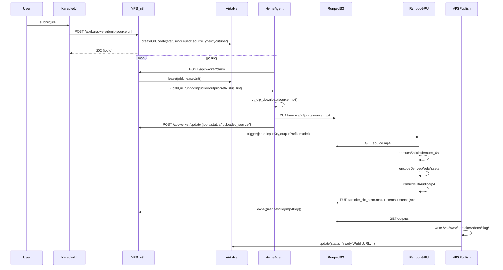
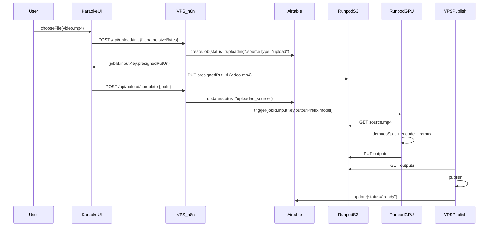
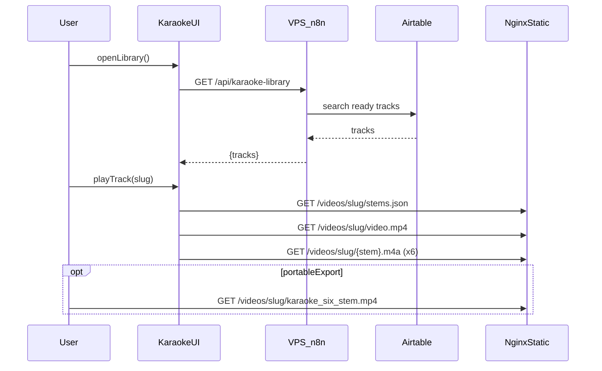
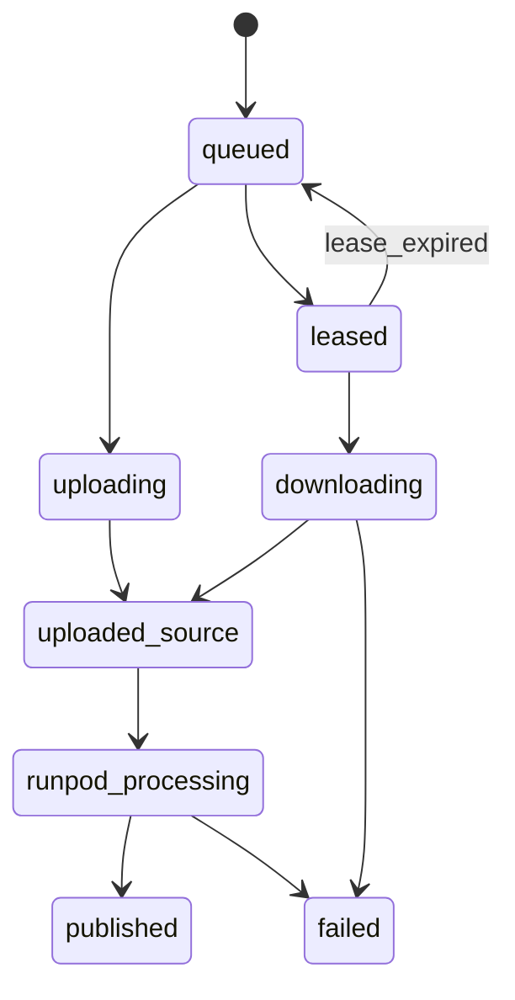

# Karaoke Pipeline PRD (Final Consolidated)

## 0) Executive Summary

You have:

- A **prototype** that delivers the best end-user results: a **single self-contained MP4** with **video + 6 labeled stem audio tracks**, created by Demucs (GPU) and remuxed with ffmpeg.
- A **nice production React UI** that currently plays and mixes **separate stem files** (plus `stems.json`) efficiently.

Your VPS cannot reliably download from YouTube due to **datacenter IP reputation blocking** (cookies do not bypass). CPU-only Demucs on VPS also underperforms relative to your 4070 GPU results.This PRD defines a robust, redundant, automated pipeline:

- **Home Linux PC (residential IP)** performs YouTube downloads.
- **Runpod Serverless GPU** performs Demucs separation and produces:
- **Canonical portable artifact**: `karaoke_six_stem.mp4` (multi-audio MP4)
- **Derived web mixer artifacts**: `video.mp4` + 6 stem `.m4a` + `stems.json`
- **Runpod Network Volume (S3 API)** is the durable handoff bus.
- **VPS** publishes outputs and maintains the Airtable library.
- Add a **manual upload path** to serverless so non-YouTube MP4s can be processed identically.

Long-term direction (confirmed): prefer **single remuxed MP4** for portability, while keeping derived stems as optional cache for the web UI.---

## 1) References (Source of Truth)

This PRD reflects your repo’s current artifacts:

- Prototype contract: [`Hostinger/karaoke-prototype/README.md`](Hostinger/karaoke-prototype/README.md)
- Remux script pattern: [`Hostinger/containers/demucs/build_karaoke_six_stem.bat`](Hostinger/containers/demucs/build_karaoke_six_stem.bat)
- React UI contract & current architecture: [`Hostinger/apps/karaoke-ui/README.md`](Hostinger/apps/karaoke-ui/README.md)
- Current n8n processing workflow: [`Hostinger/n8n-workflows/karaoke-pipeline.json`](Hostinger/n8n-workflows/karaoke-pipeline.json)
- Current n8n library workflow: [`Hostinger/n8n-workflows/karaoke-library-api.json`](Hostinger/n8n-workflows/karaoke-library-api.json)
- Human diagram/docs: [`Hostinger/n8n-workflows/KARAOKE_PIPELINE_DIAGRAM.txt`](Hostinger/n8n-workflows/KARAOKE_PIPELINE_DIAGRAM.txt), [`Hostinger/n8n-workflows/KARAOKE_PIPELINE_README.md`](Hostinger/n8n-workflows/KARAOKE_PIPELINE_README.md)
- YouTube block diagnosis: [`Hostinger/logs/yt-dlp-test-log.md`](Hostinger/logs/yt-dlp-test-log.md)
- Runpod worker baseline: [`Hostinger/runpod-demucs-worker/handler.py`](Hostinger/runpod-demucs-worker/handler.py)

---

## 2) Problem Statement

1. **YouTube download fails from VPS**

- Root cause: VPS IP reputation / bot detection.
- Cookies and OAuth do not resolve.

2. **CPU-only separation quality/performance is insufficient**

- You validated best results from Demucs GUI on 4070 GPU.

3. Need **automation** while keeping the quality of the prototype and a good-looking UI.

---

## 3) Goals & Non-Goals

### 3.1 Goals

- **G1**: Prototype-quality separation using GPU Demucs `htdemucs_6s`.
- **G2**: Fully automated pipeline: submit URL or upload video → processed assets published → indexed to library.
- **G3**: Robustness & redundancy: safe retries, resumable jobs, no inbound home networking dependency.
- **G4**: Canonical durable artifact: single multi-audio MP4 per track.
- **G5**: Maintain React karaoke-ui as primary UX.

### 3.2 Non-Goals (MVP)

- Lyrics overlay, mic input, multi-user accounts.
- UI direct demux from multi-audio MP4 (prototype technique) on day 1.

---

## 4) Product Decisions (Confirmed)

- **Primary playback/export artifact**: single **multi-audio MP4** (`karaoke_six_stem.mp4`).
- **Runpod outputs**: **both** canonical MP4 **and** web mixer artifacts.
- **Interim UI**: React karaoke-ui continues using separate stems/manifest for interactive mixing.
- **Long-term**: optimize toward “single MP4 only” by treating stems as cache or by upgrading UI.

---

## 5) System Overview

### 5.1 Components

- `KaraokeUI_React`: User UI.
- `VPS_Nginx_Static`: Hosts `/videos/*`.
- `VPS_n8n_API`: Webhook endpoints (submit/library/jobs + worker + upload).
- `Airtable_KaraokeLibrary`: Track catalog + job state.
- `HomeLinuxAgent`: Residential IP YouTube downloader.
- `RunpodS3_NetworkVolume`: Durable handoff bus.
- `RunpodServerlessGPU`: Demucs + encoding + remux.

### 5.2 Core principles

- Home worker is **outbound-only** and **pull-based**.
- Jobs are **lease-based** (no stuck jobs).
- Outputs are **idempotent** (jobId/slug scoped paths).
- `karaoke_six_stem.mp4` is **canonical**, stems are **derived/cached**.

---

## 6) Diagrams (Readable)

### 6.1 Processing swimlane (YouTube source)

### 6.2 Processing swimlane (Manual upload)

### 6.3 Library & playback swimlane

### 6.4 Job state machine

---

## 7) Output Contracts

### 7.1 Canonical portable artifact (preferred long-term)

Published at `/videos/{slug}/`:

- `karaoke_six_stem.mp4`
- Video track copied.
- 6 AAC tracks for stems.
- Each track labeled via `handler_name` (Vocals, Drums, Bass, Guitar, Piano, Ambience).
- Original stereo mix is not included to avoid double audio.

### 7.2 Derived web mixer artifacts (current UI contract)

Published at `/videos/{slug}/`:

- `video.mp4` (video-only stream)
- `vocals.m4a`, `drums.m4a`, `bass.m4a`, `guitar.m4a`, `piano.m4a`, `other.m4a`
- `stems.json` manifest

### 7.3 `stems.json` schema (must match UI)

- Must match the shape described in [`Hostinger/apps/karaoke-ui/README.md`](Hostinger/apps/karaoke-ui/README.md).

---

## 8) API Contracts (n8n)

All are n8n webhooks proxied through the VPS `/api/*`.

### 8.1 Submit (YouTube)

- `POST /api/karaoke-submit`
- Request: `{ "source": "https://youtube.com/watch?v=..." }`
- Response: `202 { jobId, status:"accepted" }`
- Behavior:
- Create/update job record: `ProcessingStatus=queued`, `SourceType=youtube`, `SourceURL=...`.

### 8.2 Library

- `GET /api/karaoke-library`
- Response: `{ tracks:[...], total:n }`
- Must return at least: `title, artist, slug, duration, publicUrl`.
- Recommendation: either filter to ready or include `processingStatus`.

### 8.3 Job status

- `GET /api/jobs?jobId=...`
- Response: `{ jobId, status, message?, slug?, publicUrl?, updatedAt? }`
- Used by UI polling.

### 8.4 Worker claim (HomeAgent)

- `POST /api/worker/claim`
- Auth: `Authorization: Bearer WORKER_TOKEN`
- Response:
- `204` if no claimable job
- `200 { jobId, url, runpodBucket, runpodInputKey, outputPrefix, slugHint, leaseUntil }`

### 8.5 Worker update

- `POST /api/worker/update`
- Auth: `Authorization: Bearer WORKER_TOKEN`
- Request: `{ jobId, status, message?, bytes?, inputKey?, heartbeat?:true }`

### 8.6 Manual upload init

- `POST /api/upload/init`
- Request: `{ filename, sizeBytes, mimeType? }`
- Response: `{ jobId, slugHint, runpodBucket, inputKey, outputPrefix, presignedPutUrl, expiresAt }`

### 8.7 Manual upload complete

- `POST /api/upload/complete`
- Request: `{ jobId }`
- Behavior: verify object exists (S3 HEAD), mark `uploaded_source`, trigger Runpod.

---

## 9) Airtable Schema (Library + Jobs)

Recommended to keep one record per track/job in `KaraokeLibrary` for MVP.

### 9.1 Required fields

- `Title` (text)
- `Artist` (text)
- `Slug` (text, unique)
- `Duration` (number)
- `PublicURL` (url)
- `SourceURL` (url)
- `VideoID` (text, optional for uploads)
- `ProcessingStatus` (single select)
- `JobID` (text)
- `SourceType` (single select: youtube, upload)
- `LastError` (long text)
- `UpdatedAt` (date)

### 9.2 Leasing/worker fields

- `LeaseOwner` (text)
- `LeaseUntil` (date)
- `Attempts` (number)
- `WorkerHeartbeatAt` (date)

### 9.3 Slug strategy

- YouTube: slug derived from metadata (uploader/title sanitize).
- Upload: slug initially derived from filename.
- After processing, refine title/artist if metadata available; slug stability is important once published.

---

## 10) Home Linux PC (Download Worker)

### 10.1 Role

Solve YouTube VPS IP blocking by downloading via residential IP.

### 10.2 Reliability model

- Outbound-only, pull-based.
- systemd service with auto-restart.
- Lease-based claiming.
- Local spool.
- Heartbeat.

### 10.3 Required software

- Linux (Ubuntu recommended)
- `yt-dlp`
- `ffmpeg`
- `python3`
- `curl`, `jq`

### 10.4 Configuration (env file)

Store in `/etc/karaoke-agent/env` (chmod 600), example:

- `VPS_API_BASE=https://karaoke.1215group.com/api`
- `WORKER_TOKEN=...`
- `RUNPOD_S3_ENDPOINT=https://s3api-us-ca-2.runpod.io`
- `RUNPOD_BUCKET=n6tzw6zfhk`
- `RUNPOD_S3_KEY=...`
- `RUNPOD_S3_SECRET=...`
- `POLL_INTERVAL_SECONDS=30`
- `DOWNLOAD_DIR=/var/lib/karaoke-agent/spool`

### 10.5 Worker loop (behavior)

- Poll claim.
- Download MP4 using yt-dlp.
- Upload to `karaoke/in/{jobId}/source.mp4`.
- Update status.
- Heartbeat while idle.

### 10.6 systemd service

- `Restart=always`, `RestartSec=5`
- `EnvironmentFile=/etc/karaoke-agent/env`
- Logs via `journalctl -u karaoke-home-agent`

### 10.7 Security

- Worker token never in Git.
- YouTube cookies stored only on home machine if used.

---

## 11) Runpod Worker (Serverless GPU)

### 11.1 Inputs

- `job_id`, `bucket`, `input_key`, `output_prefix`
- `model` default `htdemucs_6s`

### 11.2 Outputs

- Canonical: `karaoke_six_stem.mp4`
- Derived web: `video.mp4`, stems `.m4a`, `stems.json`

### 11.3 Processing requirements

- Accept MP4 input.
- Convert/normalize to WAV internally for Demucs.
- Run Demucs on GPU.
- Encode stems for web.
- Remux multi-audio MP4 using ffmpeg mapping equivalent to the batch script.

---

## 12) Publishing (VPS)

- VPS downloads outputs from Runpod S3 and writes to `/var/www/karaoke/videos/{slug}/`.
- NGINX serves `/videos/*`.
- Update Airtable record to `ready` with `PublicURL`.

---

## 13) Acceptance Criteria

### 13.1 MVP

- Submit YouTube URL → completes without VPS YouTube access.
- Manual upload MP4 → completes and is indexed.
- Published directory contains both canonical MP4 and derived web assets.
- React UI lists track in library and can play/mix stems.
- User can download `karaoke_six_stem.mp4`.

### 13.2 Reliability

- Lease expiry re-queues job if worker dies.
- Failures record `LastError` and status.
- Heartbeat monitoring detects worker down.

---

## 14) Roadmap Toward “Single MP4 Only”

### Phase 1 (MVP): Dual output

- Canonical MP4 + derived web assets.

### Phase 2: Canonical MP4 + cached derived assets

- Treat derived assets as cache (purge/regenerate).

### Phase 3: UI consumes multi-audio MP4

- Either client-side demux (prototype technique) or server-side demux-on-demand.

---

## 15) Recommendations

- Keep dual output at least through MVP and early stabilization.
- Prefer direct-to-Runpod-S3 presigned uploads for manual ingestion.
- Add alerting for stuck jobs and stale worker heartbeat.
- Keep yt-dlp updated on home worker.