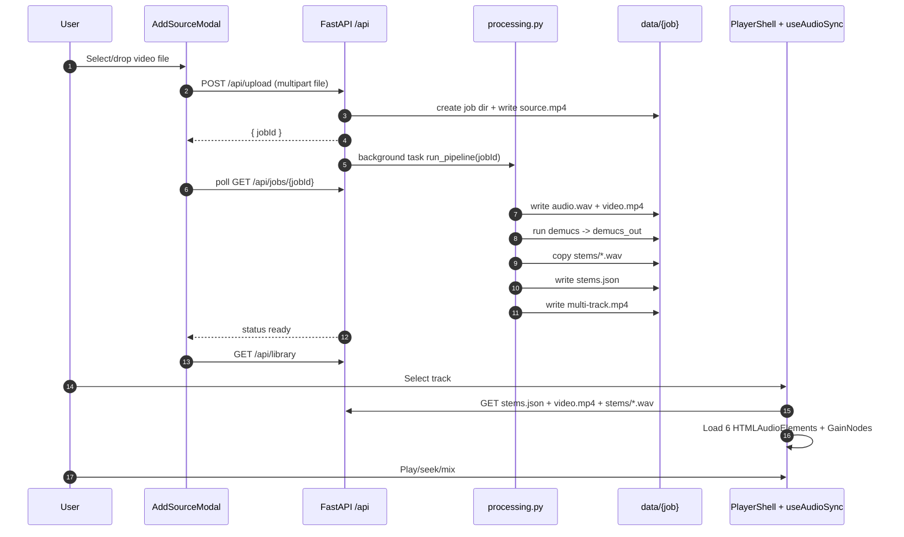
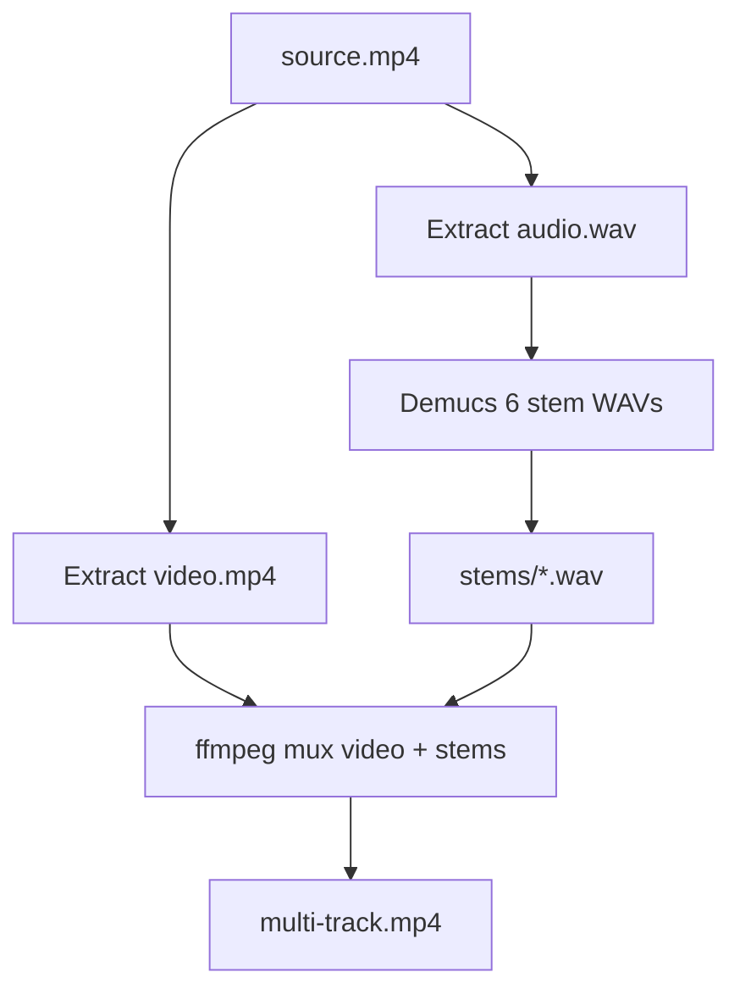

# K25 Repo Workflow Review and Assessment

Date: 2026-03-24
Reviewer: Codex agent
Scope: Current local pipeline in this repository (`local-server/`, `ui/`, launch scripts, runtime `data/` layout) with notes on drift from cloud-era docs.

## Executive Assessment

The active system is a **functional local-first karaoke pipeline**:
- ingest local video upload,
- split into 6 stems with Demucs,
- package playable artifacts,
- serve via FastAPI,
- mix stems in a React/Web Audio player.

It is coherent and usable, but currently optimized for single-user local operation. The largest shortfalls are:
- no durable job state (in-memory only),
- serialized processing (single global lock),
- no built-in cleanup/retention,
- some documentation and UX text still reflects the older cloud/n8n architecture,
- and a few correctness/performance risks in dependency checks and media handling.

## 1) Active System Map

```mermaid
flowchart LR
  U[User Browser] -->|Upload MP4| UI[React UI]
  UI -->|POST /api/upload| API[FastAPI local-server :8001]
  API -->|save source.mp4| DATA[(data/job_id)]
  API --> PIPE[processing.run_pipeline]
  PIPE -->|ffmpeg extract audio| A[audio.wav]
  PIPE -->|ffmpeg extract video| V[video.mp4]
  PIPE -->|demucs htdemucs_6s| D[demucs_out/.../*.wav]
  PIPE -->|copy stems| S[stems/*.wav]
  PIPE -->|write| M[stems.json]
  PIPE -->|ffmpeg mux| MT[multi-track.mp4]
  UI -->|GET /api/library| API
  UI -->|GET /api/tracks/{job}/stems.json + media| API
  UI -->|Web Audio gain control| MIX[6 Stem Mix Playback]
```

### Active vs legacy areas

- **Active path**: `local-server/`, `ui/`, `launch-local.ps1`, `docker-compose.yml`, `data/`.
- **Legacy/reference**: `archive/` and cloud-oriented docs still describe n8n/Supabase/CloudFront flows not currently used by active local runtime.

## 2) End-to-End Workflow (Current Code)



## 3) File Creation and Artifact Lifecycle

For each uploaded job, the canonical local directory is:

`data/<job_id>/`

### Artifact timeline

| Stage | Created files | Purpose |
|---|---|---|
| Upload | `source.mp4` | Original user input |
| Extract audio | `audio.wav` | Demucs input (temporary) |
| Extract video | `video.mp4` | Silent video for playback/mux |
| Split | `demucs_out/.../*.wav` | Raw Demucs outputs (temporary) |
| Normalize output | `stems/vocals.wav` `stems/drums.wav` `stems/bass.wav` `stems/guitar.wav` `stems/piano.wav` `stems/other.wav` | Final stem assets served to UI |
| Manifest | `stems.json` | Metadata contract for player |
| Packaging | `multi-track.mp4` | Video + 6 AAC tracks, downloadable |
| Cleanup | remove `audio.wav`, remove `demucs_out/` | reclaim temporary space |

### Current manifest contract

- `video`: `video.mp4`
- `stems[].file`: `stems/*.wav`
- stem IDs in UI include `shizzle` alias mapped from Demucs `other`.

## 4) Stem Splitting and Weaving (Mux) Details

### Split pipeline

1. `ffmpeg` extracts stereo WAV (`pcm_s16le`, 44.1k, 2ch).
2. Demucs command:
   - model: `htdemucs_6s`
   - key args: `--segment 7 --overlap 0.25 --shifts 0 --int24`
3. Stems copied into stable `stems/` location.

### Re-weaving into multi-track media

1. `ffmpeg` takes `video.mp4` + each stem WAV as separate inputs.
2. Maps one video stream + six audio streams.
3. Encodes each audio track AAC @ 256k.
4. Writes handler names (`Vocals`, `Drums`, etc.; `other` displayed as `Shizzle`).
5. Outputs `multi-track.mp4`.



## 5) Strengths

- Clear, understandable local architecture and API surface.
- Practical stage-based status updates (`pending`, `extracting`, `splitting`, `encoding`, `ready`, `failed`).
- Security guard against path traversal in track file serving.
- Player design separates muted video transport from independent stem audio graph.
- Good operator ergonomics for local dev (`launch-local.ps1`, Docker GPU container, Vite proxy).

## 6) Shortfalls and Risks

### High priority

1. **Non-durable job state**
   - Job registry is in-memory (`jobs` dict). Restart loses all active/completed status state.
   - Impact: poor recoverability, stale UI polling, no post-crash introspection.

2. **Single global processing lock**
   - `_pipeline_lock` enforces one job at a time for all users.
   - Impact: queue latency and poor throughput even on capable hardware.

3. **Dependency check can false-pass Demucs**
   - `check_dependencies()` runs `python -m demucs --help` but does not validate return code.
   - Impact: startup may report healthy while split stage fails later.

4. **Runtime/doc drift**
   - Cloud/n8n/S3/YouTube language still present in several docs/UI text but active runtime is file upload local processing.
   - Impact: onboarding confusion, wrong mental model, support friction.

### Medium priority

5. **No lifecycle retention policy**
   - `data/` grows indefinitely; large media quickly consumes disk.

6. **Upload constraints are minimal**
   - No explicit file size limits, quotas, duration caps, or content validation beyond broad mime check.

7. **No resumable/background durability**
   - UI has "Run in Background", but backend persistence does not survive process restart.

8. **Audio asset weight for browser playback**
   - Serving six WAV stems increases network and decode cost.
   - Better suited to compressed streamable format for playback path.

### Lower priority / hygiene

9. **Terminology inconsistency**
   - `other` vs `shizzle`, and default_gain semantics between manifest/UI can be confusing.

10. **Observability gaps**
    - Minimal metrics/tracing; difficult to diagnose bottlenecks (Demucs time vs I/O vs mux time).

11. **Automated test coverage appears limited for active local path**
    - Increases regression risk on pipeline edits.

## 7) Robustness Improvement Proposals

### Proposal A: Durable job model

- Persist job metadata to `data/jobs.jsonl` or lightweight SQLite.
- Include:
  - `job_id`, timestamps, stage transitions, error text, file sizes/durations.
- On startup:
  - recover in-progress jobs as `failed_recoverable` or retryable.

### Proposal B: Bounded queue + worker model

- Replace one global lock with:
  - configurable worker concurrency (`N`),
  - queue depth limits,
  - explicit backpressure (`429`/`503` with retry-after).
- Optional policy: one Demucs at a time + parallel lightweight stages.

### Proposal C: Safer ingest policy

- Enforce max upload size and optional max duration.
- Verify container/codec with `ffprobe` before enqueue.
- Reject unsupported formats early with actionable error messages.

### Proposal D: Retention and cleanup

- Add periodic cleanup task:
  - keep recent `N` jobs or `X` days,
  - preserve only `stems.json + stems + video + multi-track` unless debug mode.
- Add disk watermark checks before accepting new upload.

### Proposal E: Better failure and retry mechanics

- Stage-level retries for transient ffmpeg/disk/network failures.
- Structured error codes:
  - `DEPENDENCY_MISSING`, `DEMUX_FAILED`, `DEMUCS_FAILED`, `MUX_FAILED`, etc.
- Surface concise user-facing messages in status API.

## 8) Performance Improvement Proposals

### Playback path

1. **Serve compressed stems for UI playback**
   - Keep WAV for archival if desired, but generate AAC/Opus for browser mix path.
   - Reduce bandwidth and decode pressure significantly.

2. **Lazy load / staged prefetch**
   - Load first-play stems first, optional preload strategy for slower networks.

3. **Tune sync cadence**
   - Current drift correction every 5s is simple; consider adaptive intervals based on observed drift.

### Processing path

1. **Pipeline profiling**
   - Capture per-stage timings and output sizes in job metadata.
   - Use percentile reports to identify true bottlenecks.

2. **I/O optimization**
   - Stream subprocess logs without capturing full buffers in memory for long-running commands.

3. **Demucs parameter tuning presets**
   - Offer quality profiles (fast/standard/high) for different turnaround needs.

## 9) Suggested Target Architecture (Incremental)

```mermaid
flowchart TD
  IN[Upload API] --> VAL[Validation + ffprobe gate]
  VAL --> Q[(Persistent Queue/DB)]
  Q --> W1[Worker 1]
  Q --> W2[Worker 2]
  W1 --> ART[(data/<job>/artifacts)]
  W2 --> ART
  ART --> IDX[(Library Index)]
  IDX --> LIB[/api/library]
  Q --> JOB[/api/jobs/{id}]
  MON[Retention + Metrics + Health] --> Q
  MON --> ART
```

## 10) Practical 30/60/90 Plan

### 0-30 days (stabilize)
- Fix dependency check return-code validation.
- Add persistent job history (JSONL or SQLite).
- Add upload size/duration gates.
- Align docs and UI labels to current local workflow.

### 31-60 days (scale safely)
- Introduce bounded queue + configurable concurrency.
- Add retention/cleanup worker and disk-pressure checks.
- Add structured stage metrics and basic dashboard endpoint.

### 61-90 days (optimize UX/perf)
- Add compressed stem derivatives for playback.
- Add quality presets and estimated completion time hints.
- Add e2e regression tests for upload->ready->playback path.

## 11) Overall Verdict

The repository has a solid local MVP with clear code boundaries and an understandable media pipeline. To become robust under sustained real-world use, it needs durability (persistent jobs), controlled concurrency, and stronger operational safeguards (validation, cleanup, metrics). The current structure is good enough to evolve incrementally without major rewrites.

## 12) README Alignment Check (Added)

`README.md` was reviewed against active code paths and is now aligned to current runtime behavior:

- clarified this repo's active path is local (`local-server` + `ui`) and `archive/` is legacy;
- clarified ingest is current local file upload path (`/api/upload`);
- added first-run frontend dependency install note (`ui` `npm install`);
- corrected artifact lifecycle details so temporary files are marked as transient (`audio.wav`, `demucs_out/`).

Residual note:
- legacy YouTube wording in the empty-library UI copy was removed to align with current local upload-only behavior; README now includes an explicit note that URL ingest is intended to return in a future cloud-based workflow.

